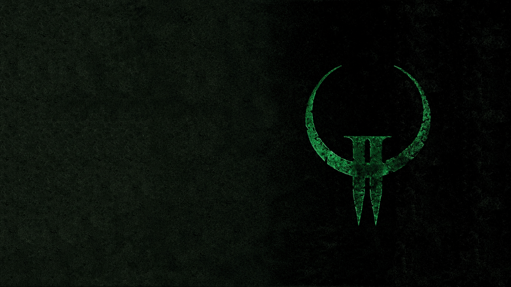

# Quake II for PlayStation 3 — v2.21 preservation release

This repository preserves the physical-PS3-validated v2.21 baseline of the
Yamagi Quake II PS3 port. The release combines the native RSX renderer with
single-player gameplay, IPv4 network play, native PS3 on-screen keyboard input,
DualShock 3 controls, sound, optional PlayStation Move support, optional SPU
work, display filters, and stereoscopic 3D.

The v2.21 executable is the accepted compatibility baseline. Later renderer
experiments are retained in the development history, but are not used by the
full-install PKG in this release.

## Release files

The private release contains two alternatives:

| File | Purpose | SHA-256 |
| --- | --- | --- |
| `Quake-II-PS3-v2.21-full.gnpdrm.pkg` | Full HDD installation, including the supplied game data | `03E47A91FCC2754621FBDC06294039CE3AAEDAF2C07564BBC3E92EEAFE5E14A2` |
| `Quake-II-PS3-v2.21.iso` | Standalone Cobra/webMAN-style disc image | `090FDA26DA9D721B48173A91EB124ACADCE203A1B9D650DA09EAA57C9315E121` |

The PKG uses the exact v2.21 NPDRM `EBOOT.BIN` that was tested on physical
hardware. The ISO keeps the v2.21 engine/render/input/audio object set and
changes only the two platform objects required to load data from `/dev_bdvd`
and store writable files on the HDD. See
[release provenance](docs/RELEASE_PROVENANCE.md) for the audit.

## Feature status

- Native RSX geometry, texture, lightmap, depth/stencil, blending, and display
  filter paths.
- Single-player campaign, save/load, local play, and remappable DualShock 3.
- IPv4 UDP client/server play, DNS names, LAN broadcast, and persistent
  multiplayer address-book input through the PS3 on-screen keyboard.
- 48 kHz stereo game audio and optional Ogg music tracks.
- Optional HDMI 720p frame-packed stereoscopic 3D and top-and-bottom output.
- (WIP) Optional PlayStation Move wand aiming with PlayStation Eye calibration and
  inertial fallback; a Navigation controller remains on the gamepad path.
- Optional SPU frame acceleration and selectable CRT/scanline-style filters.
- XMB-configured output plus 720p and 1080p video choices.

## Install

Use either the PKG or the ISO, not both for the first smoke test. Full steps are
in [Installation](docs/INSTALLATION.md).

The port requires legally acquired Quake II game data. The private binaries in
this preservation set contain the game data supplied by the project owner.
Those PAK files are not covered by the engine's GPL license and must not be
published or committed to a public repository.

## Known v2.21 limitations

- Text is cleanest with UI scaling at `1x`. At larger UI scales, the native RSX
  `conchars` path can show doubled or smeared glyphs. Keep `r_consolescale 1`,
  `r_menuscale 1`, and `r_hudscale 1` for the most reliable presentation.
- Frame-packed 3D can apply underwater, damage, or power-up full-screen tint to
  one eye incorrectly. That later experiment is deliberately not folded into
  this frozen v2.21 compatibility release.
- Native PS3 USB mouse/keyboard bridging was added after v2.21 and is not part
  of this exact baseline. The PS3 system on-screen keyboard is present and is
  the supported text-entry path here.
- Native RSX point-parameter setup may report `failed`; Quake II's normal
  triangle/quad rendering remains available. Paletted textures are expanded to
  regular RSX textures, so `paletted textures: disabled` is informational.
- Performance depends strongly on resolution, stereo, filters, and scene
  complexity. The 720p performance profile is the recommended starting point.

See [Known issues](docs/KNOWN_ISSUES.md) for more detail.

## Source and development history

The repository contains the GPL engine/game-code working snapshot and the
complete PS3 development history. The release executables are preserved frozen
binaries; the exact hashes and build relationship are documented separately.

- [Build notes](docs/BUILDING.md)
- [Release provenance](docs/RELEASE_PROVENANCE.md)
- [Optimization handover](docs/OPTIMIZATION_HANDOVER.md)
- [Detailed PS3 development history](docs/DEVELOPMENT_HISTORY.md)
- [Private GitHub upload guide](docs/PRIVATE_GITHUB_UPLOAD.md)

## Licensing

Engine and game-code sources are distributed under GPLv2; see [LICENSE](LICENSE).
Quake II names, artwork, and commercial game data remain the property of their
respective owners and are not relicensed by this repository.
